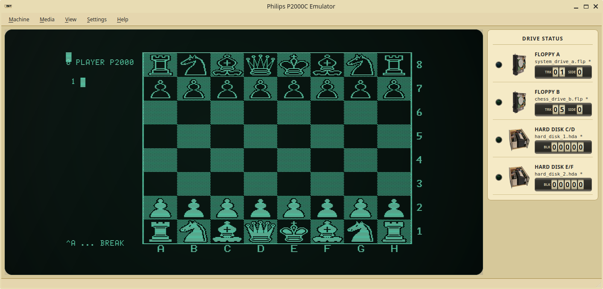

# Philips P2000C emulator

The Philips P2000C Emulator recreates the classic Z80-based Philips P2000C
luggable computer. It provides a Qt graphical interface for interactive use and
a headless command-line mode for scripting and automated testing.



## Features

- Boots CP/M and runs original P2000C software
- Supports two floppy drives while preserving source disk images by default
- Reproduces the 80x24 text display and graphics mode
- Provides scripted keyboard input and screen-text detection
- Exposes the screen, CPU state, cursor, cycle count, and memory as JSON
- Offers accelerated storage for fast, deterministic automation
- Builds as either a complete desktop application or a standalone headless core

## Compilation

### Requirements

- CMake 3.24 or newer
- A C++20 compiler
- Qt 6.4 or newer (`Core`, `Gui`, and `Widgets`)
- OpenAL development files

On Debian/Ubuntu, the required packages are commonly named `qt6-base-dev` and
`libopenal-dev`.
MSYS2 MinGW users can install the corresponding `mingw-w64-*-qt6-base` and
`mingw-w64-*-cmake` packages.

### Build

The default preset selects GCC and an optimized CMake `Release` build. With
GCC, this currently produces `-O3 -DNDEBUG` for C and C++ sources.

```sh
cmake --preset default
cmake --build --preset default
ctest --preset default
```

For a GCC debug build, use a separate directory:

```sh
cmake -S . -B build-debug -DCMAKE_BUILD_TYPE=Debug \
  -DCMAKE_C_COMPILER=gcc -DCMAKE_CXX_COMPILER=g++
cmake --build build-debug
```

Run the graphical shell with:

```sh
./build/p2000c
```

### Headless command-line emulation

`p2000c_cli` drives the Qt-free emulator core in batch mode. Actions are
performed from left to right, so one invocation can boot CP/M, wait for a
prompt, type commands, and inspect the resulting screen and memory:

```sh
./build/p2000c_cli \
  --ipl tools/IPLDUMP.BIN \
  --floppy-a images/system.flp \
  --floppy-b images/zork.flp \
  --wait-for 'A>' \
  --send 'B:\rZORK1\r' \
  --wait-for 'West of House' \
  --output json
```

Text arguments decode `\r`, `\n`, `\t`, `\xNN`, and `\\`. The default output
is a readable 80x24 screen; JSON additionally reports the program counter,
cycle count, cursor, graphics mode, and optional `--dump-memory ADDRESS:LENGTH`
ranges. `--run CYCLES` provides fixed-duration execution when no unique screen
text is available. Each `--wait-for` is bounded by `--wait-cycles` and a timeout
returns status 3 after emitting the final machine state.

Mounted media are copied to temporary writable files by default, keeping source
images unchanged. Pass `--write-through` only when guest writes should persist.
`--fast-storage` bypasses modeled floppy latency for automation. See all options
with `./build/p2000c_cli --help`.

The CLI and its core can be built without Qt or OpenAL:

```sh
cmake -S . -B build-headless -DP2000C_BUILD_APP=OFF
cmake --build build-headless --target p2000c_cli
```

## License

The emulator's original source code is licensed under the GNU General Public
License version 3 only (`GPL-3.0-only`); see `LICENSE`. The vendored Z80 core
retains its MIT/Expat license and copyright notice.

The manuals, firmware dumps, disk images, and supplied font image are reference
or machine assets and are not relicensed by the GPL declaration for our source
code. Their redistribution remains subject to the rights applicable to each
asset.
