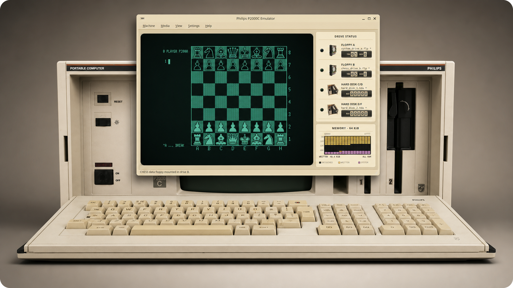
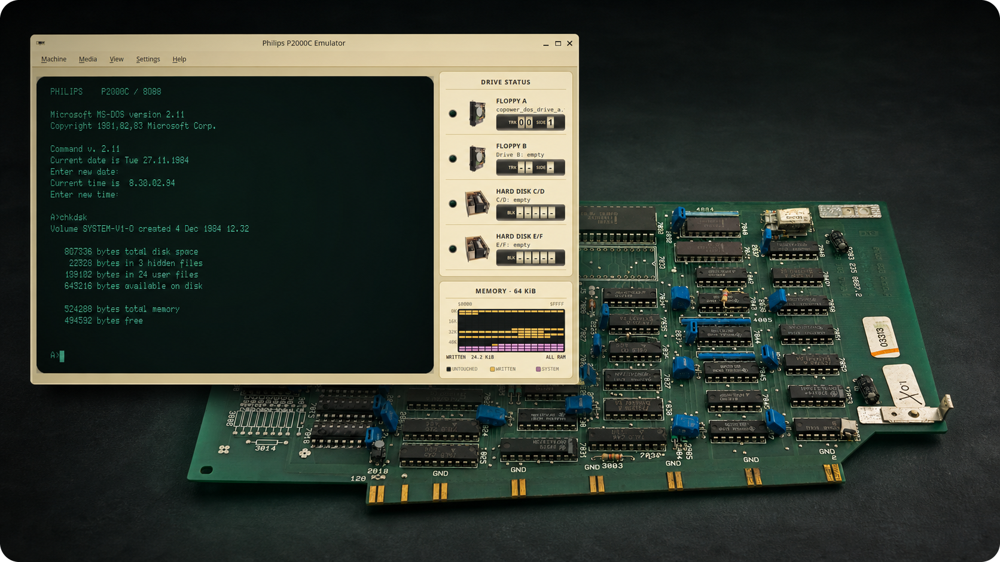

# Philips P2000C emulator

[](https://github.com/ifilot/p2000c-emulator/actions/workflows/build-and-package.yml) [](https://github.com/ifilot/p2000c-emulator/releases/latest) [](https://github.com/ifilot/p2000c-emulator/blob/main/LICENSE)

The Philips P2000C Emulator recreates the classic Z80-based Philips P2000C
luggable computer.

## Features

- Boots CP/M and runs original P2000C software
- Supports two floppy drives while preserving source disk images by default
- Emulates the optional 512 KiB Philips P2093 CoPower 8088 board and MS-DOS 2.11
- Reproduces the 80x24 text display and graphics mode
- Offers accelerated storage for fast, deterministic automation



## Downloads

Prebuilt packages are available from the
[latest GitHub release](https://github.com/ifilot/p2000c-emulator/releases/latest).
Choose the package for your platform:

| Operating system | Architecture | Package |
| --- | --- | --- |
| Windows | x86-64 | [Graphical installer (`windows-x86_64.exe`)](https://github.com/ifilot/p2000c-emulator/releases/latest) |
| macOS | Apple silicon (arm64) | [Disk image (`macos-arm64.dmg`)](https://github.com/ifilot/p2000c-emulator/releases/latest) |
| macOS | Intel (x86-64) | [Disk image (`macos-x86_64.dmg`)](https://github.com/ifilot/p2000c-emulator/releases/latest) |
| Linux | x86-64 | [Portable AppImage (`linux-x86_64.AppImage`)](https://github.com/ifilot/p2000c-emulator/releases/latest) |
| Linux | x86-64 | [Graphical installer (`linux-x86_64.run`)](https://github.com/ifilot/p2000c-emulator/releases/latest) |

### Updating an existing installation

The current graphical installers are fully offline and do not support in-place
updates. To install a newer version:

1. Close P2000C Emulator.
2. Uninstall the existing version using your operating system's application
   manager or the P2000C Emulator Maintenance Tool.
3. Download and install the latest release.

Application preferences are stored separately from the installation directory
and are preserved. Keep personal disk images and other files outside the
application installation directory, because that directory is removed during
uninstallation. AppImage users can simply replace the old AppImage with the new
one.

## P2093 CoPower board emulation



The optional Philips P2093 CoPower board added an Intel 8088 and (a maximum of)
512 KiB of memory to the Z80-based P2000C, allowing it to run MS-DOS alongside
its native CP/M environment. The emulator models the communication between both
processors, shared-memory arbitration, interrupts, and DRAM refresh closely
enough to boot the original MS-DOS 2.11 software and pass the board's `TEST88`
diagnostics.

The desktop application includes a one-click fast-boot path, bundled boot and
system-disk images, and automatic board configuration. The same environment can
also be scripted through the headless command-line emulator for reproducible
tests and automated software runs.

## Compilation

### Requirements

- CMake 3.24 or newer
- A C++20 compiler
- Qt 6.4 or newer (`Core`, `Gui`, and `Widgets`)
- OpenAL development files

On Debian/Ubuntu, the required packages are commonly named `qt6-base-dev` and
`libopenal-dev`.
MSYS2 MinGW users can install the corresponding `mingw-w64-*-qt6-base` and
`mingw-w64-*-cmake` packages.

### Build

The default preset selects GCC and an optimized CMake `Release` build. With
GCC, this currently produces `-O3 -DNDEBUG` for C and C++ sources.

```sh
cmake --preset default
cmake --build --preset default
ctest --preset default
```

For a GCC debug build, use a separate directory:

```sh
cmake -S . -B build-debug -DCMAKE_BUILD_TYPE=Debug \
  -DCMAKE_C_COMPILER=gcc -DCMAKE_CXX_COMPILER=g++
cmake --build build-debug
```

Run the graphical shell with:

```sh
./build/p2000c
```

## Headless command-line emulation

`p2000c_cli` drives the Qt-free emulator core in batch mode. Actions are
performed from left to right, so one invocation can boot CP/M, wait for a
prompt, type commands, and inspect the resulting screen and memory:

```sh
./build/p2000c_cli \
  --ipl tools/ipldump/IPLDUMP.BIN \
  --floppy-a images/cpm/system.flp \
  --floppy-b images/cpm/zork.flp \
  --wait-for 'A>' \
  --send 'B:\rZORK1\r' \
  --wait-for 'West of House' \
  --output json
```

Text arguments decode `\r`, `\n`, `\t`, `\xNN`, and `\\`. The default output
is a readable 80x24 screen; JSON additionally reports the program counter,
cycle count, cursor, graphics mode, and optional `--dump-memory ADDRESS:LENGTH`
ranges. `--run CYCLES` provides fixed-duration execution when no unique screen
text is available. Each `--wait-for` is bounded by `--wait-cycles` and a timeout
returns status 3 after emitting the final machine state.

Mounted media are copied to temporary writable files by default, keeping source
images unchanged. Pass `--write-through` only when guest writes should persist.
`--fast-storage` bypasses modeled floppy latency for automation. See all options
with `./build/p2000c_cli --help`.

## License

The emulator's original source code is licensed under the GNU General Public
License version 3 only (`GPL-3.0-only`); see `LICENSE`. The vendored Z80 core
retains its MIT/Expat license and copyright notice. The 8086/8088 interpreter
is derived from `blink16`/`86sim` and retains the ISC notice shipped by the
pinned upstream `blink16` repository. Its source lineage credits Andrew Jenner,
TK Chia, and Greg Haerr; see `THIRD_PARTY.md` and
`third_party/blink16_8086/LICENSE`.

The manuals, firmware dumps, disk images, and supplied font image are reference
or machine assets and are not relicensed by the GPL declaration for our source
code. Their redistribution remains subject to the rights applicable to each
asset.
